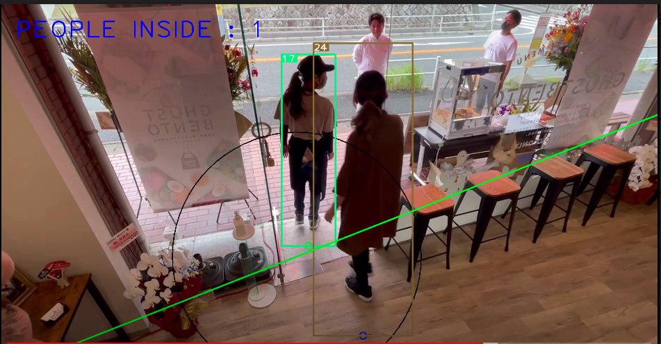

# Deep Sort with PyTorch




## Introduction
This is an implement of  tracking algorithm deep sort. Deep sort is basicly the same with sort but added a CNN model to extract features in image of human part bounded by a detector. 

I use **YOLOv3** to generate bboxes instead of FasterRCNN.


We use a line to separate between inside and outside the store, have as parameter two points (x1,y1) and (x2,y2).

We define a circle which help the model to be more accurate, the circle should surround the door of the store. The circle have as parameter Cx and R will be explained later.

The 6 parameters are normalized between 0 and 1 and given to the program as parameters. So whatever the resolution of the camera, try to normalize the points between 0 and 1 by following these formulas

```
x = real_x/real_w
```
## Dependencies
- python 3 (python2 not sure)
- numpy
- scipy
- opencv-python
- sklearn
- torch >= 0.4
- torchvision >= 0.1
- pillow
- vizer
- edict

## Quick Start
0. Check all dependencies installed
```bash
pip install -r requirements.txt
```
for user in china, you can specify pypi source to accelerate install like:
```bash
pip install -r requirements.txt -i https://pypi.tuna.tsinghua.edu.cn/simple
```


5. Run demo
```
usage: python yolov3_deepsort.py VIDEO_PATH
                                [--help]
                                [--frame_interval FRAME_INTERVAL]
                                [--config_detection CONFIG_DETECTION]
                                [--config_deepsort CONFIG_DEEPSORT]
                                [--display]
                                [--display_width DISPLAY_WIDTH]
                                [--display_height DISPLAY_HEIGHT]
                                [--save_path SAVE_PATH]          
                                [--cpu]
                                [--x1]          
                                [--x2]          
                                [--y1]          
                                [--y2]  
                                [--Cx]
                                [--R]  

# yolov3 + deepsort
python yolov3_deepsort.py [VIDEO_PATH] --x1 0 --x2 1 --y1 1 --y2 0.3 --R 0.19 --Cx 0.45

# yolov3_tiny + deepsort
python yolov3_deepsort.py [VIDEO_PATH] --config_detection ./configs/yolov3_tiny.yaml --x1 0 --x2 1 --y1 1 --y2 0.3 --R 0.19 --Cx 0.45

# yolov3 + deepsort on webcam
python3 yolov3_deepsort.py /dev/video0 --camera 0 --x1 0 --x2 1 --y1 1 --y2 0.3 --R 0.19 --Cx 0.45

# yolov3_tiny + deepsort on webcam
python3 yolov3_deepsort.py /dev/video0 --config_detection ./configs/yolov3_tiny.yaml --camera 0 --x1 0 --x2 1 --y1 1 --y2 0.3 --R 0.19 --Cx 0.45
```
Use `--display` to enable display.  
Results will be saved to `./output/results.avi` and `./output/results.txt`.

# Example

```
python yolov3_deepsort.py  ../video.mp4 --save_path ../output.avi --x1 0 --x2 1 --y1 1 --y2 0.3 --R 0.19 --Cx 0.45     
```

## References
- paper: [Simple Online and Realtime Tracking with a Deep Association Metric](https://arxiv.org/abs/1703.07402)

- code: [nwojke/deep_sort](https://github.com/nwojke/deep_sort)

- paper: [YOLOv3](https://pjreddie.com/media/files/papers/YOLOv3.pdf)

- code: [Joseph Redmon/yolov3](https://pjreddie.com/darknet/yolo/)
